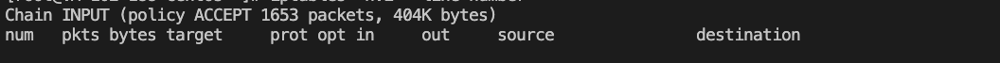
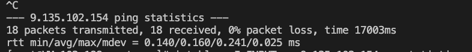
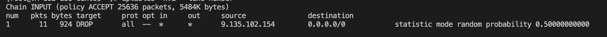
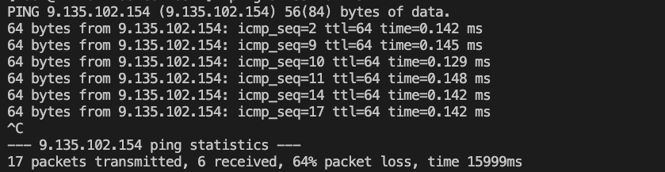

#  iptables 模拟丢包

```
在用iptables 进行网络相关测试时一些小tips记录
```

#### 介绍
- 查看所有的ip规则命令如下
    ```
    iptables -nvL --line-number
    ```
    - -L 查看当前表的所有规则，默认查看的是filter表，如果要查看NAT表，可以加上-t NAT参数
    - -n 不对ip地址进行查，加上这个参数显示速度会快很多
    - -v 输出详细信息，包含通过该规则的数据包数量，总字节数及相应的网络接口
    - –line-number 显示规则的序列号，这个参数在删除或修改规则时会用到

- 添加规则
    - 添加规则有两个参数：-A和-I。其中-A是添加到规则的末尾；-I可以插入到指定位置，没有指定位置的话默认插入到规则的首部
    添加一条规则到第2行
    ```
    iptables -I INPUT 2 -s 111.111.11.1 -j DROP
    ```
    - INPUT -s/OUTPUT -d

- 删除规则
    - 删除用 -D 有两种删除方式
    ```
    iptables -D $(INPUT -s 111.111.11.1 -j DROP) 精准删除,括号内写具体的规则
    iptables -D INPUT $(number) ，定点删除，number为规则id，可以通过iptables -nvL --line-number查看id
    ```
  
- 其他COMMAND
   ``` 
    -A 在指定链的末尾添加（append）一条新的规则
    
    -D 删除（delete）指定链中的某一条规则，可以按规则序号和内容删除
    
    -I 在指定链中插入（insert）一条新的规则，默认在第一行添加
    
    -R 修改、替换（replace）指定链中的某一条规则，可以按规则序号和内容替换
    
    -L 列出（list）指定链中所有的规则进行查看
    
    -E 重命名用户定义的链，不改变链本身
    
    -F 清空（flush）
    
    -N 新建（new-chain）一条用户自己定义的规则链
    
    -X 删除指定表中用户自定义的规则链（delete-chain）
    
    -P 设置指定链的默认策略（policy）
    
    -Z 将所有表的所有链的字节和数据包计数器清零
    
    -n 使用数字形式（numeric）显示输出结果
    
    -v 查看规则表详细信息（verbose）的信息
    ```
    
  
#### 模拟丢包命令

- 入站丢包
    - 对121这个ip进行丢包50%的处理。
    ```
    iptables -I INPUT -s 121.**.48.1 -m statistic --mode random --probability 0.5 -j DROP 
    ```
- 出站丢包
    ```
    iptables -I OUTPUT -d 9.**.102.154 -m statistic --mode random --probability 0.5 -j DROP
    ```
#### 测试情况
- 没有配置规则前：没有丢包现象
  
  
- 配置50%丢包比例规则后：丢包比例64%（应该是样本数据比较小，大的时候应该会趋近于50%）
  
  
